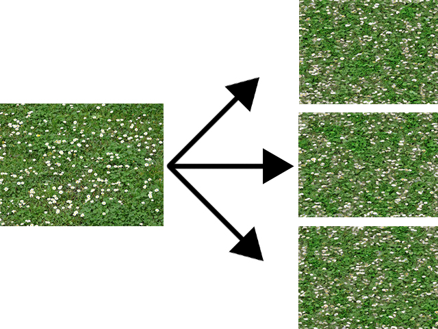
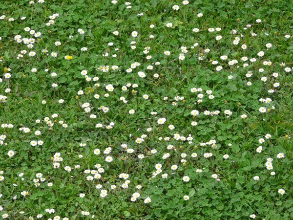
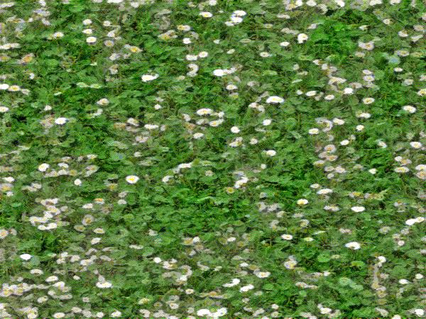
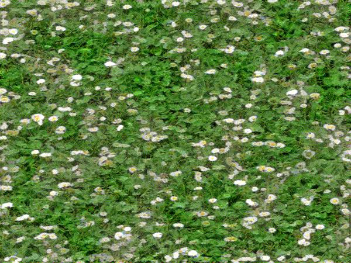
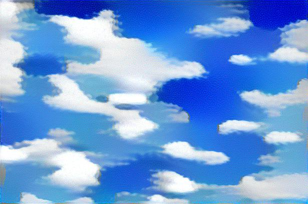
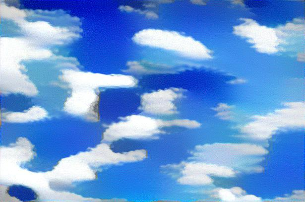
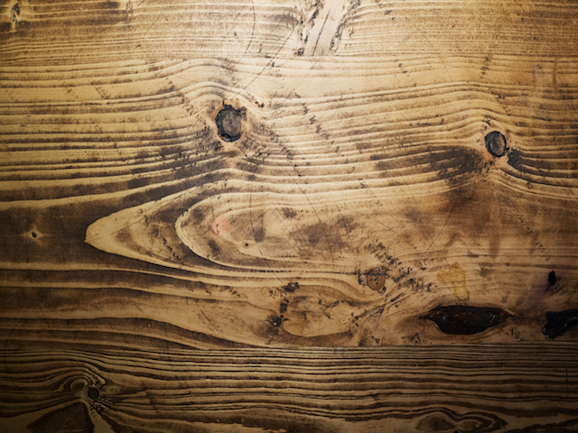
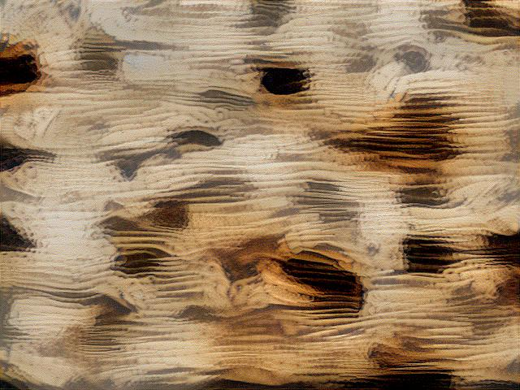
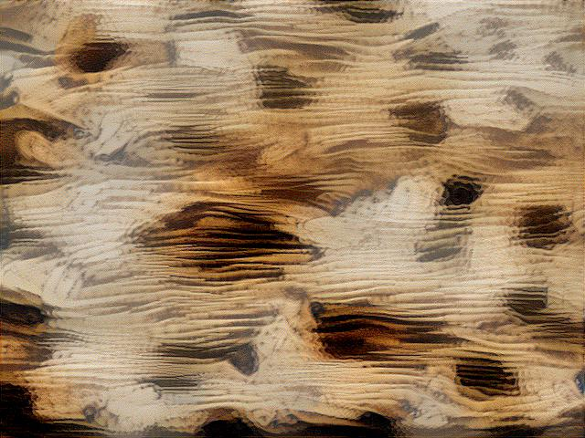

# *Texture-Synthesis* implemented in TensorFlow



This is a TensorFlow implementation of *[Texture Synthesis Using Convolutional Neural
Networks](https://arxiv.org/pdf/1505.07376v3.pdf)* using [total variation denoising](http://eeweb.poly.edu/iselesni/lecture_notes/TVDmm/TVDmm.pdf) as a regularizer. A pretrained [VGG network](https://arxiv.org/pdf/1409.1556.pdf) was used. It is provided [here](https://github.com/machrisaa/tensorflow-vgg) by [machrisaa](https://github.com/machrisaa) on GitHub. The VGG implementation was customized to accomodate the implementation requirements and is of the 19-layer variety.

Using this implementation, it is possible to emulate and achieve the same synthesized results as achieved in the original paper.

The purpose of this repository is to port the texture-synthesizing algorithm to TensorFlow.

## Results

<table style="width:100%">
  <tr>
    <th>Input</th> 
    <th>Synthesized Sample 1</th>
    <th>Synthesized Sample 2</th>
  </tr>
  <tr>
    <td></td>
    <td></td> 
    <td></td> 
  </tr>
  <tr>
    <td></td>
    <td></td> 
    <td></td> 
  </tr>
  <tr>
    <td></td>
    <td></td> 
    <td></td> 
  </tr>
</table>

## Prerequisites

* [Python 3.5](https://www.python.org/downloads/release/python-350/)
* [TensorFlow](https://www.tensorflow.org/) (>= r1.0)
* [scikit-image](http://scikit-image.org/docs/dev/api/skimage.html)
* [NumPy](http://www.numpy.org/)

## Usage

To synthesize a new texture sample, run:

```sh
python synthesize.py path/to/input/image --output path/to/output/image
```

## Files

* [synthesize.py](src/style_transfer.py)

    The main script where all the magic happens. 

* [custom_vgg19.py](src/custom_vgg19.py)
    
    A modified implementation of the VGG 19 network. This particular customization changes the default pooling of max pooling to average pooling, which allows more effective gradient flow.

* [vgg19.npy](https://www.dropbox.com/s/68opci8420g7bcl/vgg19.npy?dl=1)

    The weights used by the VGG network. This file is not in this repository due to its size. You must download it and place in the working directory. The program will complain and ask for you to download it with a supplied link if it does not find it.
    
* [utils.py](src/utils.py)

    Auxiliary routines for parsing images into numpy arrays used in the implementation.
